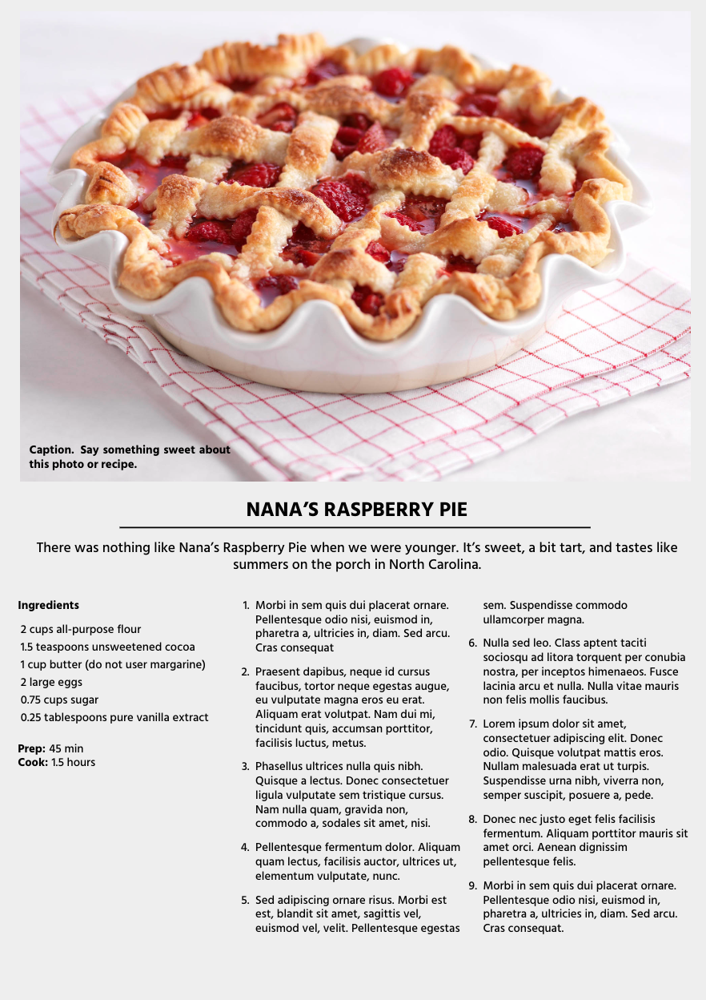

# Nana's Recipe Template

A [Craftadoc](https://craftadoc.com) template. (Using LaTeX.)

### How do I use this?

#### Option 1:

Directly use the template in your browser using Craftadoc [here!](https://app.craftadoc.com/template/overview/6379fb4f58412dce3bc17286) And fill in the template using the automatically generated UI. This is the easiest option.

#### Option 2:

Open the source code in Overleaf: visit [the template page](https://app.craftadoc.com/template/overview/6379fb4f58412dce3bc17286), select the gear icon in the top right and select `Open in Overleaf`.

#### Option 3:

Clone this repository and use your favorite latex compiler locally. (This template uses XeLatex.)

## Example:

## Source:
https://www.reddit.com/r/LaTeX/comments/futg6z/latex_cookbookrecipe_book_template/

